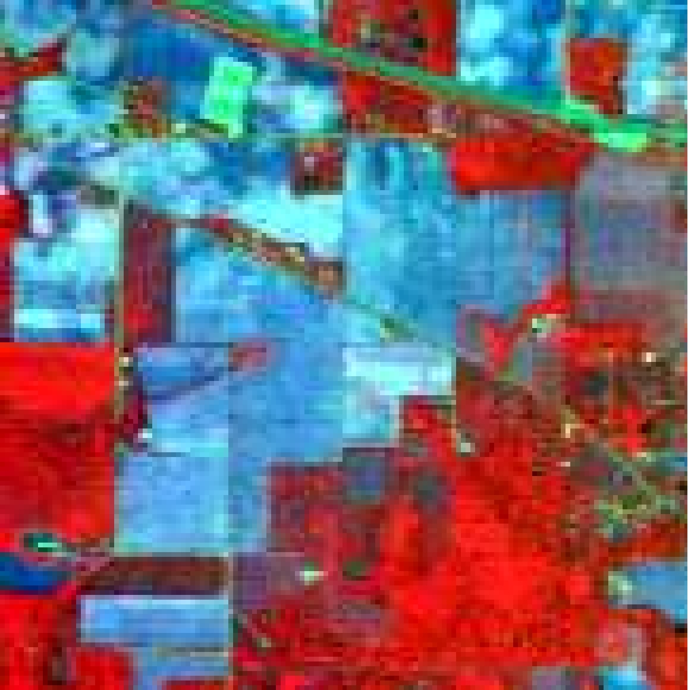
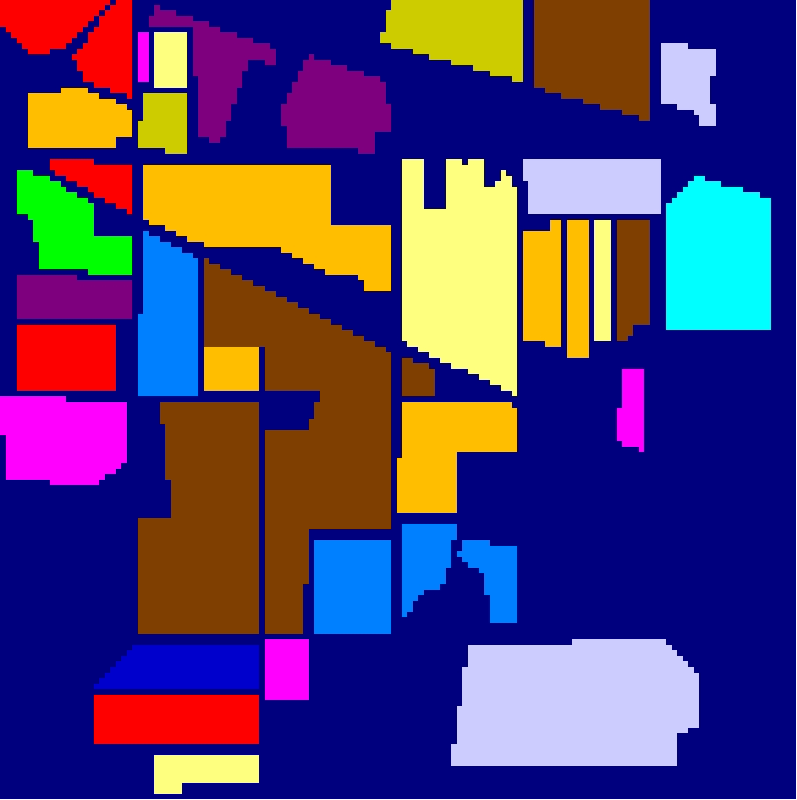
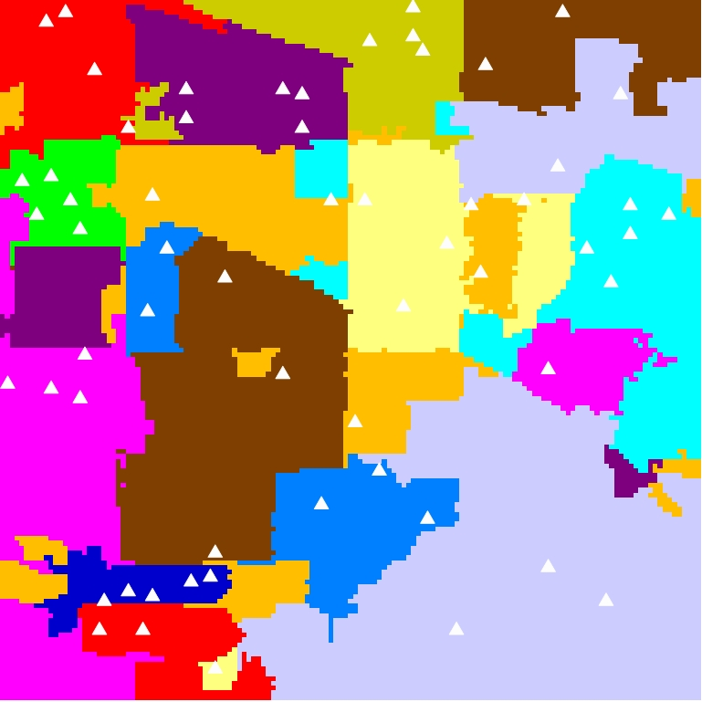

# Discriminant Superpixel Graph (dSPG) for Hyperspectral Image Classification.

## Matlab Implimentation of dSPG

Files:

demo_dSPG.m   -  Matlab demo over real AVIRIS Indian Pines dataset
                 
Within_Superpixel_Graph.m   -  Matlab function for within-superpixel graph
   
Between_Superpixel_Graph.m   -  Matlab function for between-superpixel graph

## Description

The  dSPG  is  the combination of within-superpixel graph and between-superpixel graph. 
The newly proposed within-superpixel graph is aimed at disconnecting pixels belonging to different classes in a superpixel, so as to decrease inter-class connection weights. 
The betweensuperpixel graph attempts to connect spectral adjacent superpixels to increase the intra-class subset connections.

## Results

### Indian Pines (IP) dataset

  

Fig.1  The Indian Pines dataset classification result (Overall Accuracy 85.48%) of dSPG using 5 labeled samples per class. (a) False color composition. (b) Ground truth. (c) Classification map. 

## Citation

If you use [dSPG](https://github.com/yulong112/dSPG) code in your research, we would appreciate your citation to the following paper:

@ARTICLE{yu2024dSPG,
  author={Yu, Long and Li, Jun and He, Lin and Plaza, Antonio and Wang, Lizhe and Tang, Zhonghui and Zhuo, Li and Yuan, Yuchen},
  journal={IEEE Transactions on Geoscience and Remote Sensing}, 
  title={dSPG: A New Discriminant Superpixel Graph Regularizer and Convolutional Network for Hyperspectral Image Classification}, 
  year={2024},
  volume={62},
  number={},
  pages={1-18},
  doi={10.1109/TGRS.2024.3439434}}

